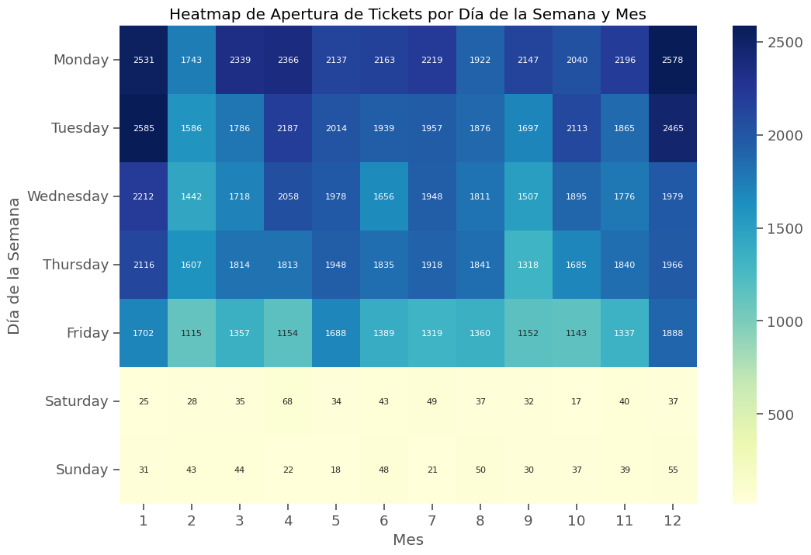
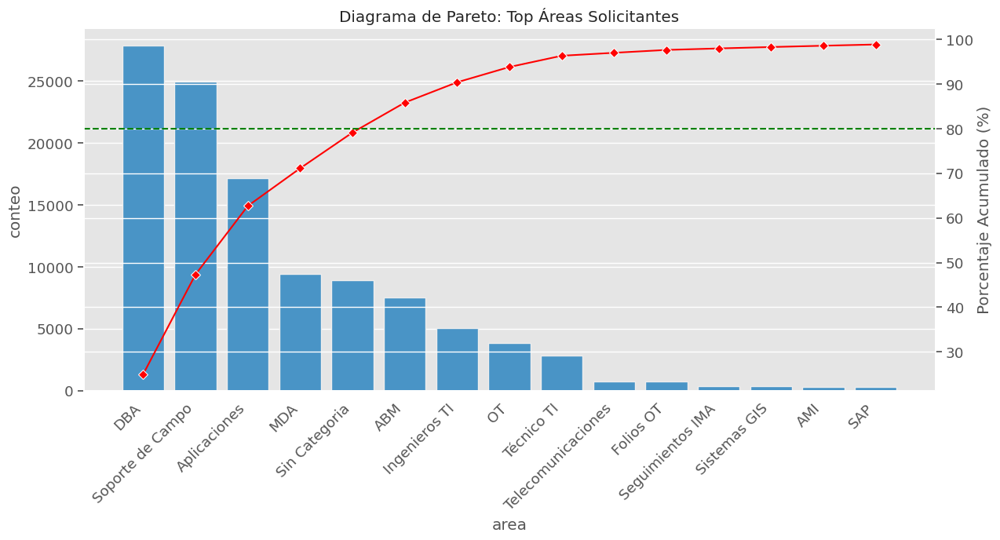
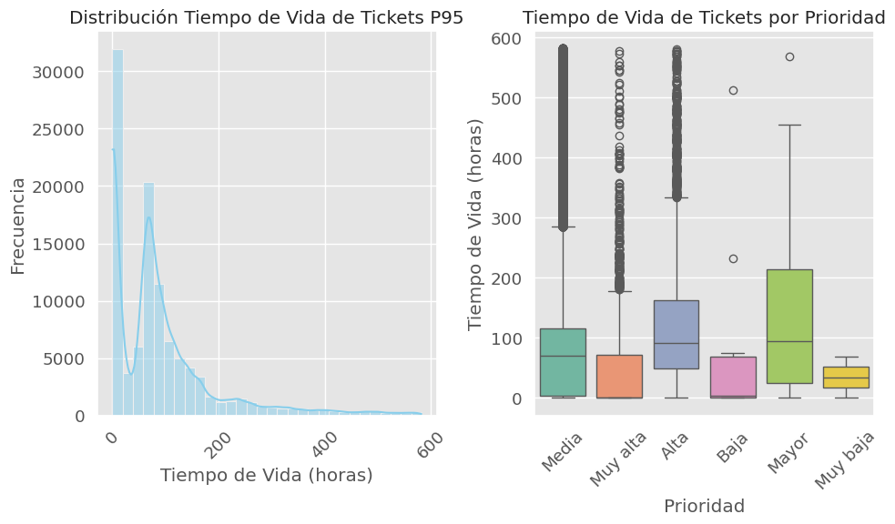
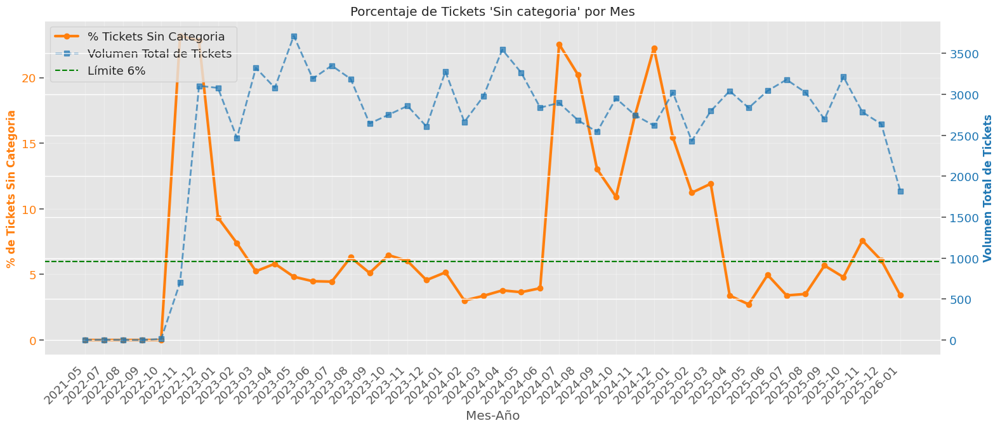
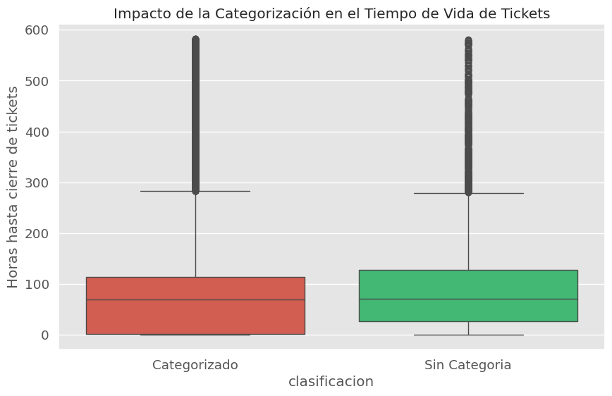
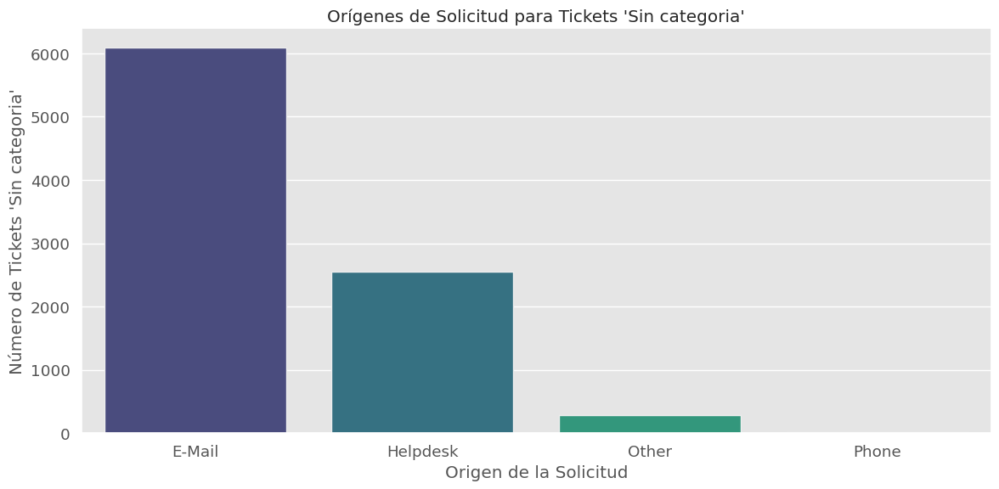
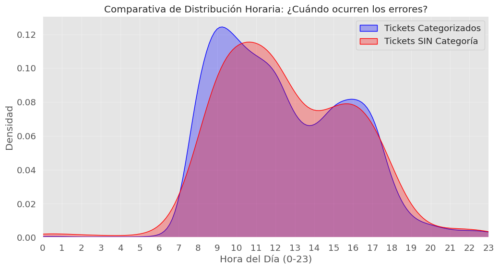
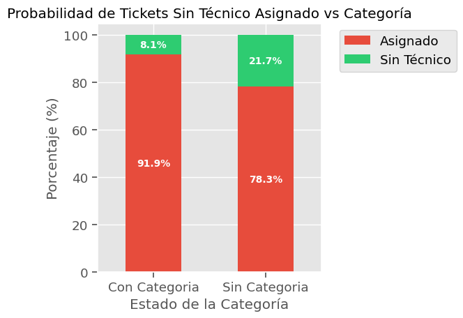
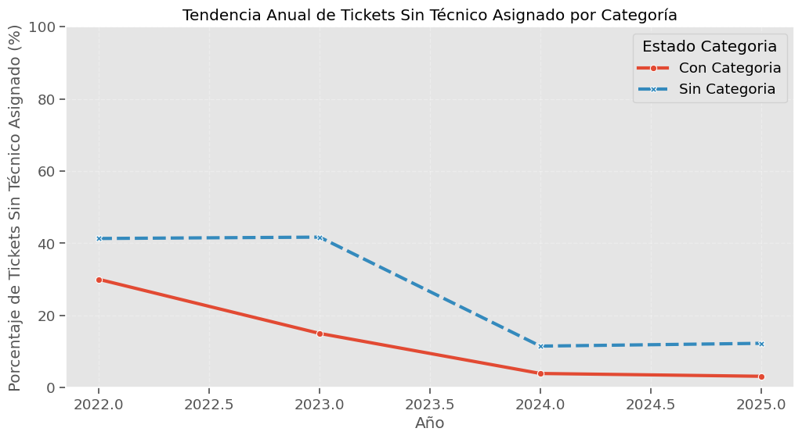

# ANALISIS EXPLORATORIO DE DATOS

El objetivo es identificar observaciones, tendencias, estacionalidad, explosion de demandas, etc.

## Analisis estacionalidad y tendencias con HEATMAP

### Heatmap de Dia vs Hora de apertura de ticket
La gran mayoria de los ticket tiene apertura en horario laboral de lunes a viernes (8:00 - 18:00 hrs.). Dentro de esa tendencia los dias LUNES es donde presento una mayor solicitud de ticket, disminuyendo a medida que avanzamos al VIERNES.

Las horas picos donde se solicitan mayores tickets son de las 9:00 a 10:00 horas. 

En las horas de almuerzo se aprecia una disminucion, sin embargo el dia Viernes donde se sale 15:00 horas se puede ver y apreciar que se pierde la apreciacion de la hora de almuerzo.

### Heatmap de Dias del mes vs Hora de apertura de ticket
Se puede ver las tendencias observadas previamente. Ademas que se aprecia una leve tendencia a mayor apertura de tickets en los primeros dias del mes. Aunque esta apreciacion es leve, generalmente el volumen de tickets aperturados depende en menor grado del dia del mes.

Se aprecia el mayor pick de tickets emitidos los dias 2 de cada mes a las 12:00 horas.

### Heatmap de Dia vs Mes del ticker

Los tickets segun los dias y meses no presenta diferencias muy notables, en general son continuos. Sin embargo, existe un pequeño aumento para los meses de Diciembre y Enero de la apertura de tickets.

### Heatmap de meses vs dias de la semana

Se puede ver en el heatmap que la carga esta balanceada durante el año de trabajo de forma historica. Pero Enero y Diciembre son los meses con mayor volumen de tickets generados, levemente superiores pero es algo a tener en cuenta para una calidad de tickets estandar y controlada.

### Analisis de Tickets Sin Categoria (sin Area asignada)

## Grafico de Barras Pareto 80%

Del grafico se puede ver que el area DBA y Soporte de Campo son gigantes. Ademas, hay una categoria "sin Categoria" que es grande (9000 tickets aprox.) Es importante tratar estos campos vacios para aumentar la calidad de los datos.

Las areas en conjunto de DBA, Soporte de Campo, Aplicaciones, MDA corresponden al 80% del volumen de tickets. Es decir, que si solucionaramos estas areas podriamos disminuir/solucionar el 80% de los problemas con ticketeras. Mencionar que el area "Sin Categoria" es parte de este 80%, por lo que, es un problema no poder etiquetar el area del ticket.

## Histogramas y boxplots de analisis de Prioridad y tiempos

El histograma entrega la cantidad alta de ticket con un menor tiempo de vida. Lo que se puede interpretar como que los ingenieros le dedican la mayor parte de su tiempo a resolver las tareas con menor tiempo. 

Los boxplots indican que los tickets de prioridad Muy Alta se resuelven muy rapido, por lo que, los ingenieros saben distribuir y priorizar buen sus tiempos a la resolucion.

Aunque, los de prioridad Mayor tienen los mayores tiempos de resolucion, y esta es la mayor categoria de prioridad.

## Analisis % de Tickets "Sin Categoria" por mes y correlacion con el Volumen

Se aprecia un crecimiento a mediados de 2024 y que dura hasta mediados del 2025. Esto se atribuye al cambio de proveedor directo de asistencia de tickets. Por lo que, los datos importantes por el momento de analizar es mediados de 2025.

El ingreso de la nueva empresa se puede ver que disminuyo radicalmente bajo el umbral del 6% de ticket sin categorizar, sim embargo, es preocupante el aumento lento pero progresivo de los tickets sin categoria asignada, superando el umbral llegando a noviembre de 2025 y bajando en el siguiente mes. Sin embargo, esto se atribuye a que en diciembre disminuye drasticamente el volumen de ticket asignado, y se tiene una correlacion levemente positiva (0.21). 

Por otro lado, se aprecia que los tickets no categorizados poseen mayores tiempos de resolucion, aprox. unas 11 horas mayores en promedio de vida. Siendo un 16& de retraso y esto se traduce en costo operativo.

## Origenes de los tickets Sin Categoria

El origen de los ticket solo tiene 4 opciones: Email, Helpdesk, Phone, Other. E-mail es quien alberga 6000 tickets Sin Categoria y lo sigue Helpdesk con menos de 3000. El cuello de botella que posee mas de la mitad de los tickets sin categorizar seria origen Email.

## Correlacion de Horas con creacion de ticket sin categorizar

Los tickets se puede ver que se crean la mayoria  a la misma hora y no tienen correlaciones importantes fuera de horario laboral.

## Analisis de Tickets sin asignado un tecnico y importancia a la Categoria del Ticket

Se puede ver que la Categorizacion correcta del ticket es fundamental historicamente para que el ticket tenga un tecnico resolutivo asignado. En cambio, un ticket Sin Categoria involucra un aumento de los tickets sin persona asignada.

## Analisis de asignacion de tecnico a ticket por categoria y evolucion temporal

Con el tiempo se aprecia una tendencia a la disminucion de los ticket sin personal asignado. Sin embargo, los ticket Sin Categoria siguen aumentando su porcentaje de sin asignacion de tecnico, lo que a 2025 llega a un 12.5%.

